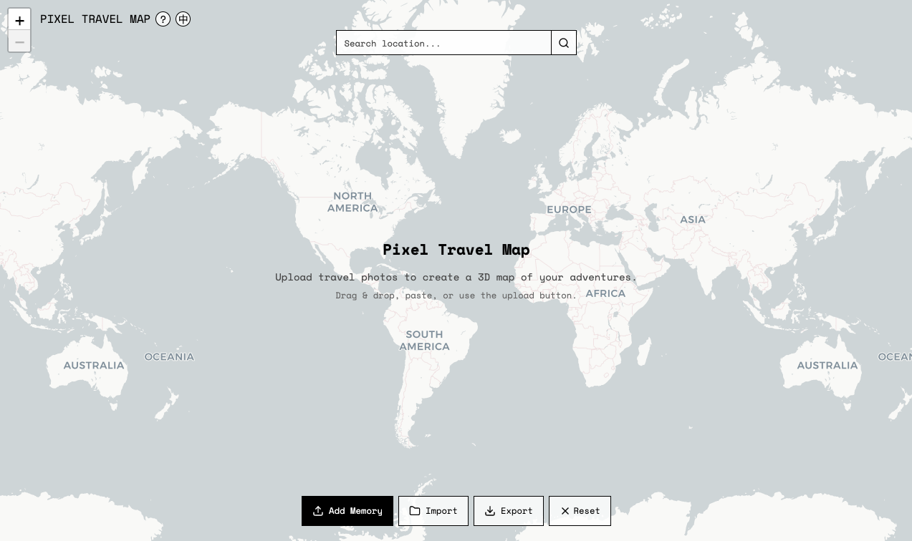

<div align="center">

</div>

# 🗺️ Pixel Travel Map

> ✨ An AI-powered interactive 「Travel Check-in Map」

> 🇨🇳 查看中文版：[README.zh-CN.md](./README.zh-CN.md)

---

## 📍 Overview

「Pixel Travel Map」is an interactive tool for visualizing your travel memories.

Simply upload a travel photo (of a building or landmark), and the app will automatically extract GPS data (if available) to locate the spot on a world map. It then uses AI to generate a pixel-art 3D model to represent that memory.

As you upload more photos, you gradually build your own **travel check-in map** ✈️🗺️

---

## ✨ Features

- 📷 Automatically extracts GPS coordinates from photo EXIF metadata
- 🌍 Allows manual placement on the map if no GPS data is found
- 🧱 Uses Nano-banana to generate pixel-style 3D landmark models
- 🗺️ Supports dragging, flipping, resizing, duplicating, and editing models
- 🔒 One-click to lock models into a memory card view
- 📝 Each memory supports adding travel notes and photo date
- 📸 Upload additional photos to enrich each memory
- 💾 Supports exporting and importing map data for backup, migration, or sharing

---

## 🎥 Demo Video

<p><b>Click the image to view the demo video</b></p>
<div align="center">
<a href="https://www.bilibili.com/video/BV11dYjzREGd/?spm_id_from=333.1387.homepage.video_card.click&vd_source=180b54ccdee7adafa153cde5e97d8245"></a>
</div>

---

## 🧪 Try It Online

👉 **[Launch in AI Studio](https://ai.studio/apps/drive/113edx7Jx0lFvbYKOFW8cxh5azo4p4SBA)**

---

## 🚀 Run Locally

### Prerequisites

- Node.js ≥ 18

### Steps

```bash
npm install
echo "GEMINI_API_KEY=your_api_key_here" > .env.local
npm run dev
```

## 💡 Acknowledgement

This project was inspired by a [tweet](https://x.com/alexanderchen/status/1961169243199672648) from Alexander Chen.