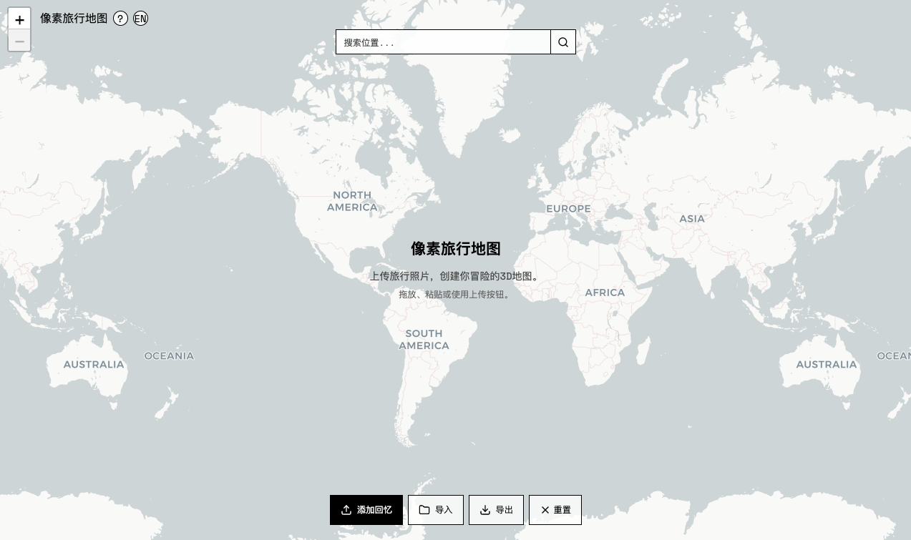

<div align="center">

</div>

# 🗺️ Pixel Travel Map

> ✨ 一個 AI 驅動的互動式「旅遊打卡地圖」 

> 🇺🇸 English version available in [here](./README.md)

---

## 📍 專案簡介

「Pixel Travel Map」是一個互動式旅行地圖工具。你只需上傳一張旅拍照片（建築或地標），系統會自動識別照片中的 GPS 資訊，為你生成一個畫素風格的 3D 模型，並放置到世界地圖上的對應位置。

當你不斷上傳更多照片，就會慢慢構建起一個**專屬的旅遊打卡地圖** ✈️🗺️

---

## ✨ 功能特色

- 📷 自動讀取照片中的 GPS 座標（支援 EXIF）
- 🌍 也可手動點選地圖進行定位放置
- 🧱 使用 Nano-banana 生成畫素風格的 3D 地標模型
- 🗺️ 支援拖動、翻轉、放大、複製、編輯模型
- 🔒 一鍵鎖定模型，轉換為卡片式回憶管理
- 📝 每個地標都支援新增旅行筆記和拍攝日期
- 📸 支援上傳更多照片作為補充回憶
- 💾 支援匯出和匯入地圖資料，便於備份、遷移或分享

---

## 🎥 影片演示

<p><b>點選圖片觀看演示影片</b></p>
<div align="center">
<a href="https://www.bilibili.com/video/BV11dYjzREGd/?spm_id_from=333.1387.homepage.video_card.click&vd_source=180b54ccdee7adafa153cde5e97d8245"></a>
</div>

---

## 🧪 線上體驗

👉 **[AI Studio 線上使用入口](https://ai.studio/apps/drive/113edx7Jx0lFvbYKOFW8cxh5azo4p4SBA)**

## 🚀 本地執行

### 前置條件

- 安裝 Node.js ≥ 18

### 執行步驟

```bash
npm install
echo "GEMINI_API_KEY=你的API金鑰" > .env.local
npm run dev
```

## 💡 致謝

靈感來源於 Alexander Chen 的[推文](https://x.com/alexanderchen/status/1961169243199672648)